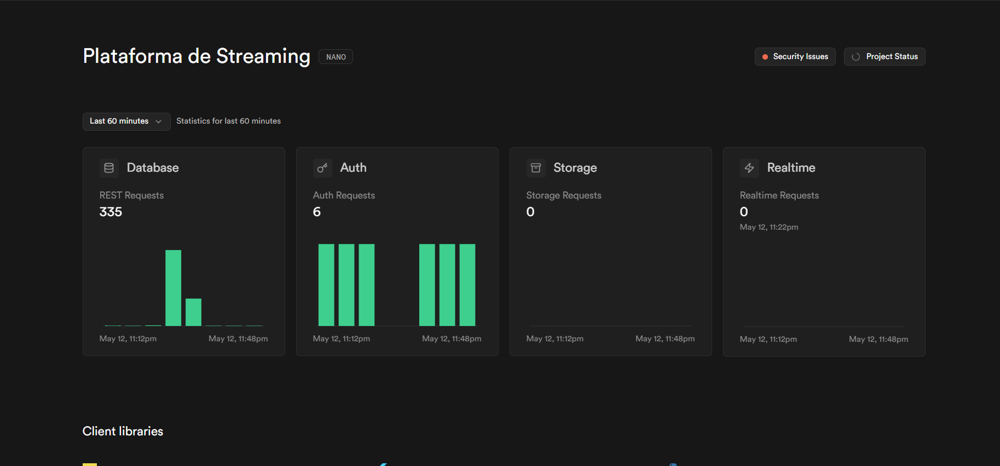

<div align="center">
  
# PLATAFORMA DE STREAMING
## PROJETO 2: BANCO DE DADOS

</div>
<br>

## Introdução
Projeto criado por:
* [Lucas Kerr](https://github.com/Adelgrin) | RA: 221230329
* [Marcela Nalesso](https://github.com/Marcela1204) | RA: 222220113

* Link do git hub: https://github.com/Marcela1204/CC5232_Projeto_2_PlataformaDeStreaming
* Link do git hub2: https://github.com/Marcela1204/CC5232_Projeto_2_PlataformaDeStreaming.git
<br>

## Descrição do Projeto
- **Objetivo**   
> Desenvolver um sistema de banco de dados para uma plataforma de streaming, com foco na gestão de conteúdos audiovisuais e interação dos usuários. O sistema deverá contemplar as seguintes entidades principais: Usuário, Filme, Série, Gênero, Avaliação, Assinatura e Plano.
<br>

- **Tabelas**   
> O banco de dados deverá conter as seguintes informações:   
1. Usuário (usuarios): id_usuario, nome, e-mail, data de nascimento e id_plano.   
2. Filme (filmes): id_filme, titulo, duracao e ano_lancamento.   
3. Genero e Filme (genero_filme): id_filme, id_genero e classificacao_indicativa.   
4. Série (series): id_serie, titulo, numero_temporadas e status.
5. Genero e Série (genero_serie): id_serie, id_genero e classificacao_indicativa.
6. Gênero (generos): id_genero, nome e descricao.   
7. Avaliação (avaliacoes): id_ avaliacao, nota, comentario, data_avaliacao, id_usuario, id_serie, id_filme.
8. Assinatura (assinaturas): id_assinatura, tipo_plano e valor.
9. Plano (planos): id_plano, data_renovacao, desconto, id_assinatura.
<br>

> O modelo de dados incluirá relacionamentos do tipo muitos-para-muitos entre:
1. Filmes e Gêneros: um filme pode estar associado a múltiplos gêneros e um gênero pode agrupar diversos filmes.
2. Séries e Gêneros: uma série pode estar associado a múltiplos gêneros e um gênero pode agrupar diversas séries.
<br>

- **Queries** 
> Para demonstrar o funcionamento do banco, foram usadas as seguintes queries:   
1. Listar os 10 filmes mais bem avaliados (com média de nota)
2. Listar todas as séries ativas com mais de 3 temporadas
3. Listar os filmes com sua classificação indicativa mais alta (caso tenha múltiplos gêneros)
4. Listar os usuários e seus planos com valor e desconto
5. Contar quantos usuários há por tipo de plano
6. Listar os usuários que nunca fizeram uma avaliação
7. Média de nota por gênero de filmes
8. Comentários recentes (últimos 7 dias) com nome do usuário e título da obra
9. Obter a quantidade de avaliações por usuário
10. Total de filmes e séries por gênero
11. Valor total arrecadado com os planos (considerando todos os usuários)
12. Filmes lançados após 2000 com média de avaliação maior que 2
<br>


## Execução do Projeto
Passo a passo para exceutar o projeto: 

### Primeiro passo: Instalar bibliotecas 'Python', 'Faker' e 'Supabase'
- Abra o Codespace do Github e instale as três bibliotecas.

### Segundo passo: Verificar URL e KEY do seu banco
- Copie e cole as chaves URL e KEY do seu banco no supabase (localização detalhada no tutorial abaixo) e substitua nas váriàveis url e key do código nos arquivos 'criarTabela.py', 'insercao.py' e 'validar.py'.
> Dica: Crie seu próprio banco de dados para que não haja problema com permissão no ‘service role’ ao rodar o código!

### Terceiro passo: Permissão do banco
- Abra o arquivo criarTabela.py, selecione o código abaixo e execute no Supabase (SQL Editor)
```python
GRANT ALL PRIVILEGES ON SCHEMA public TO service_role;

create or replace function execute_sql(sql text)
returns void as $$
begin
    execute sql;
end;
$$ language plpgsql security definer;

```
### Quarto passo: Criação das tabelas
- Abra o arquivo criarTabela.py e execute o código

### Quinto passo: População das tabelas
- Abra o arquivo popular_tabelas.py e execute o código

 
<br>
<div align="center">
  
**ASSISTA O VÍDEO TUTORIAL ABAIXO**
[](https://www.youtube.com/watch?v=Ahgipq875S4)


</div>
<br>

## Diagramas
(Caso haja alguma alteração ou pouca qualidade na imagem, há uma pasta logo acima com todas as imagens utilizadas no projeto)

### MER


### MR


***

